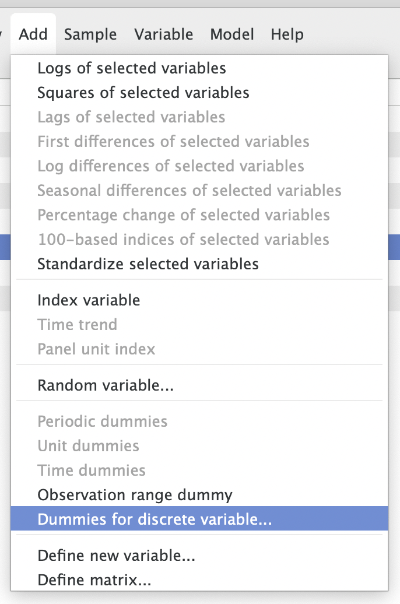
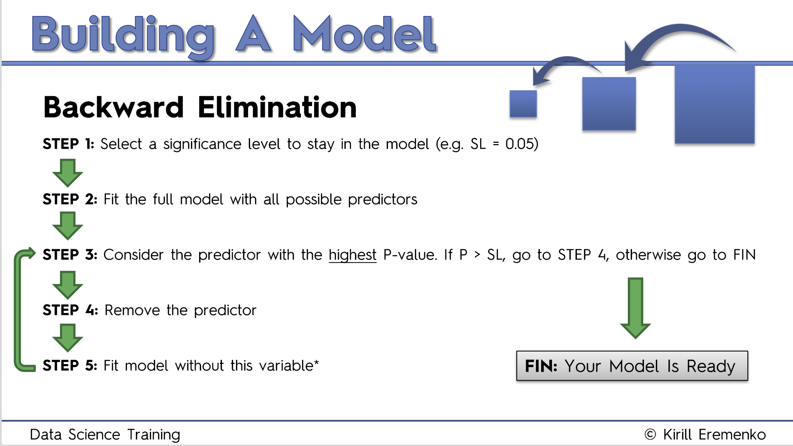
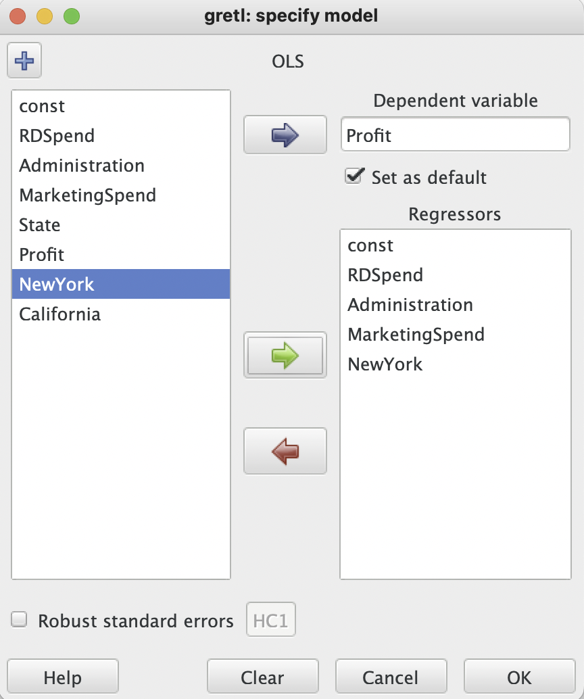
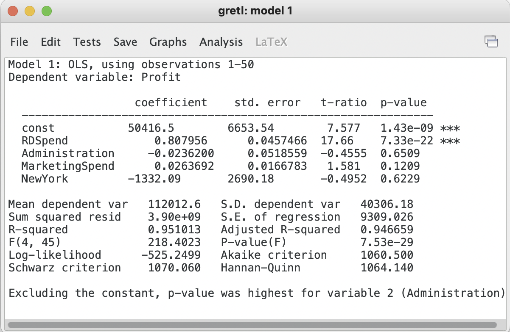
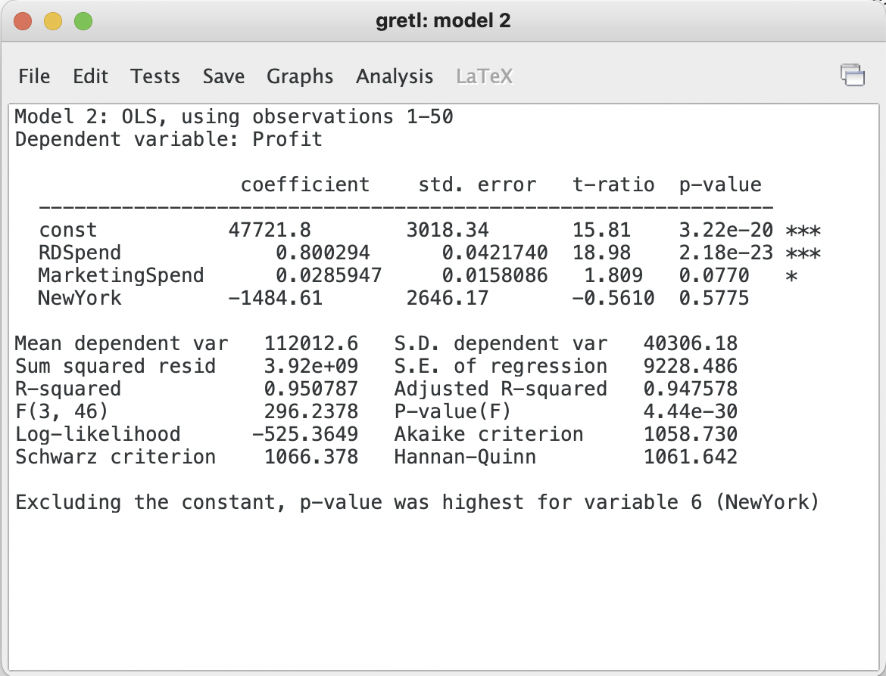
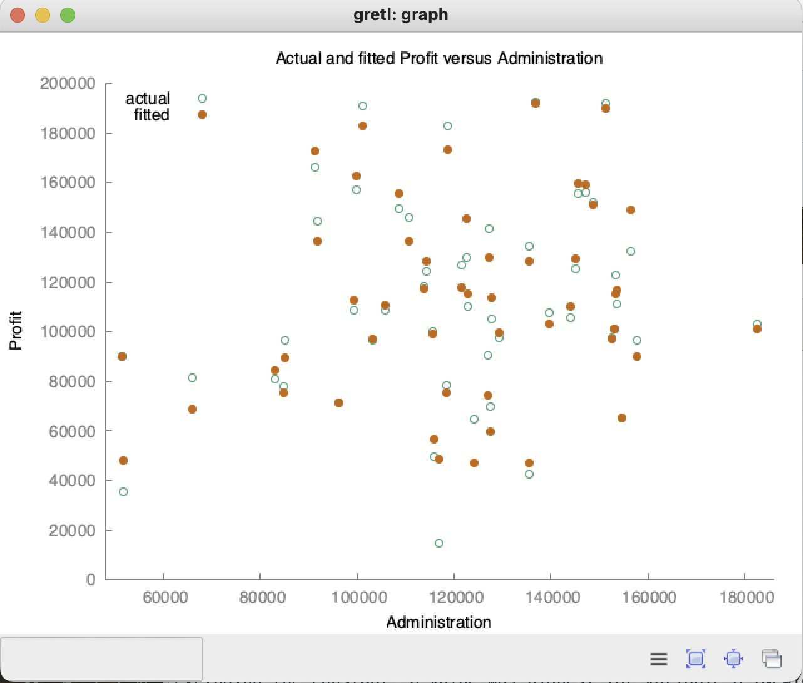
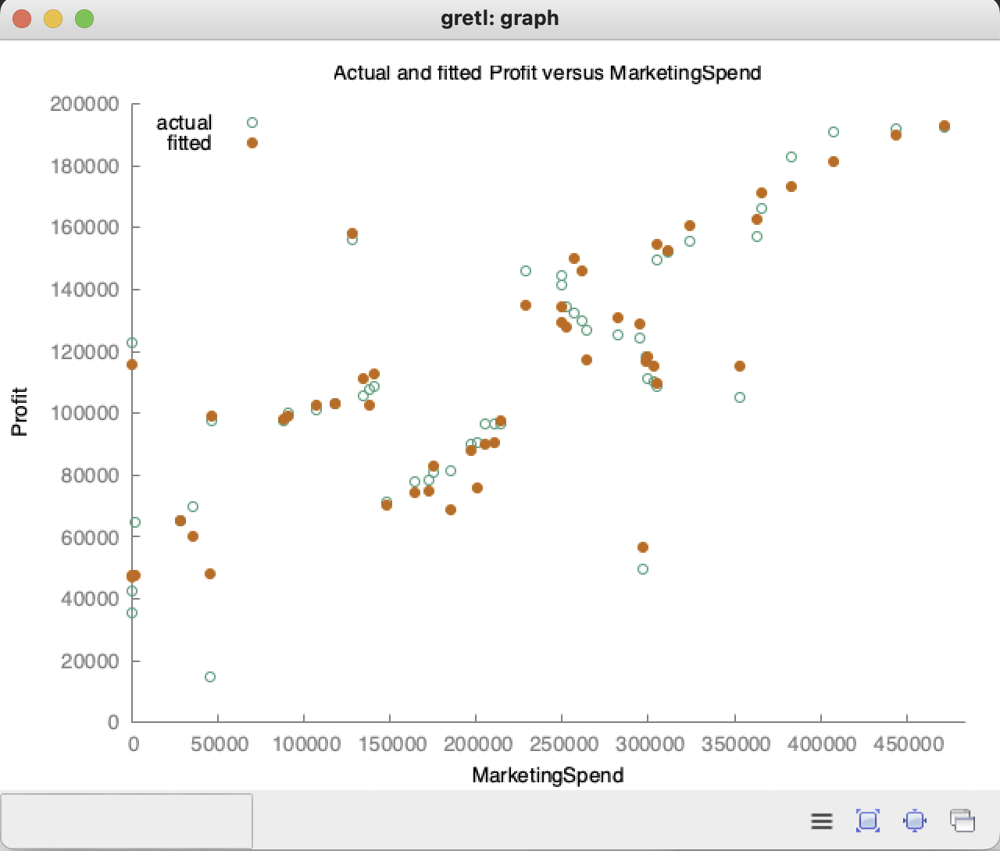

# Multiple Linear Regression with Gretl

### Ordinary Least Squares with Backward Elimination

1. import data (data/raw/ann/P12-50-StartUps.csv)
2. Gretl detects a categorical variable (State) which needs to be encoded
3. Click `Add` > `Dummies for discrete variable...`  
    
   
    
4. Click `Encode all values` (will remove specific column later)
5. Use backward elimination to eliminate unimportant features  
    
   
    
6. Fit full model with all possible predictors
7. Click `Model` > `Ordinary Least Squares`
8. Set `Dependent variable` to the **Profit** column and check `Set as default`
9.  Add all of columns to `Regressors` excluding **State** since we label encoded the values and one of the Dummy columns to avoid falling into the Dummy value trap. 
     
    
     
10. Click `OK` and examine the **p-value**
    > The `***` indicate high levels of significance

     
    
     
11. Leave the `model 1` window open and go back to **Gretl**
12. Click `Model` > `Ordinary Least Squares` and remove the column with the highest `p-value` from the **Regressors**. In this case `Administration`.
13. Examine the differences between both models  
     
    
     
14. Graph the Profit vs. Administation in `model 1` by clicking `Graphs` > `Fitted, actual plot` > `Against Administration` and notice the scatteredness of the plots. There seems to be no real correlation which is why it should be removed from the model  
     
    
     
15. Continue with step 12 until all variables are less than our acceptance level of < 0.05
16. Notice that the `p-value` of the **MarketingSpend** feature is just above our acceptance threshold, but looking at the plot you can see some linearity in the graph. This would lead you to believe there is some correlation that is important.  
     
    
     

### Adjusted R-Squared

We can improve upon the previous method by introducing Adjusted R-Squared. Looking at each models `Adjusted R-squared` value we see it increasing as we remove features with low importance until the final model where we removed `Marketing Spend` the adj. r-squared value went down signifying that the previous model including marketing spend was a stronger model. This shows that the backward elimination adjusting the p-value is not the only measure of a models relevance.