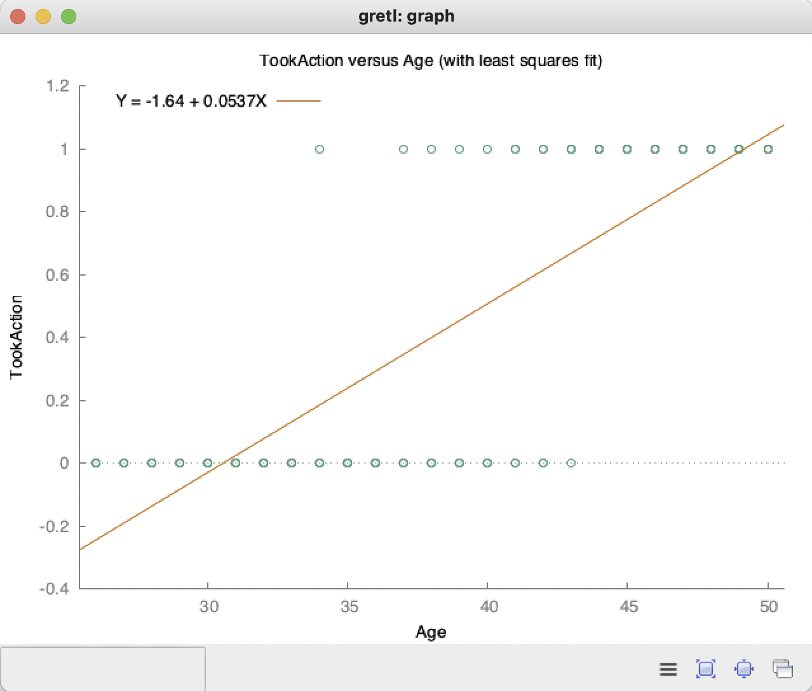
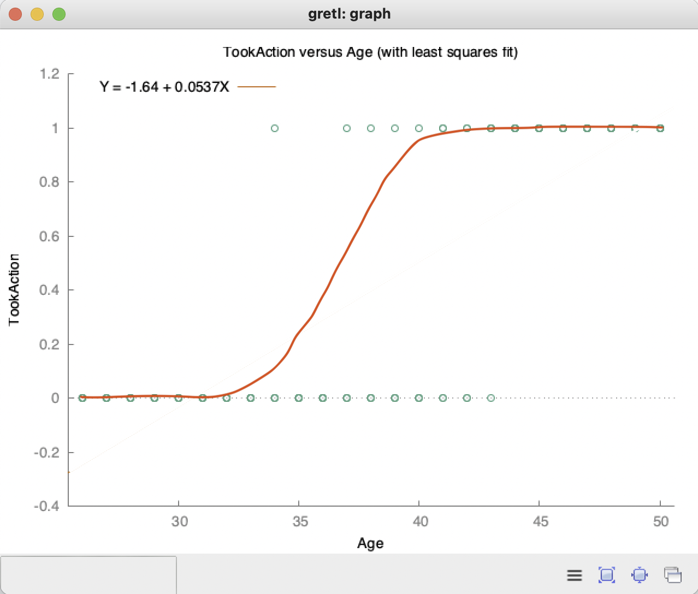
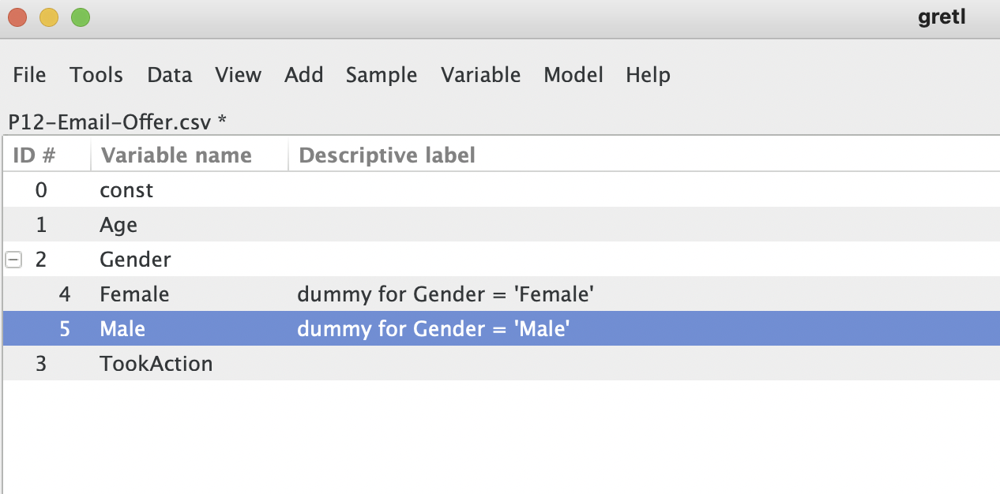
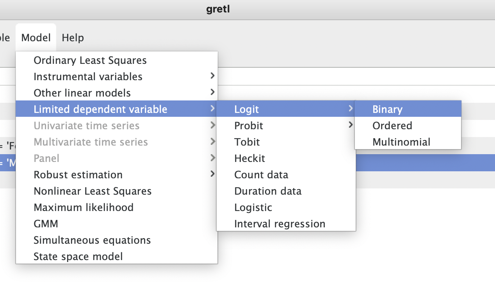
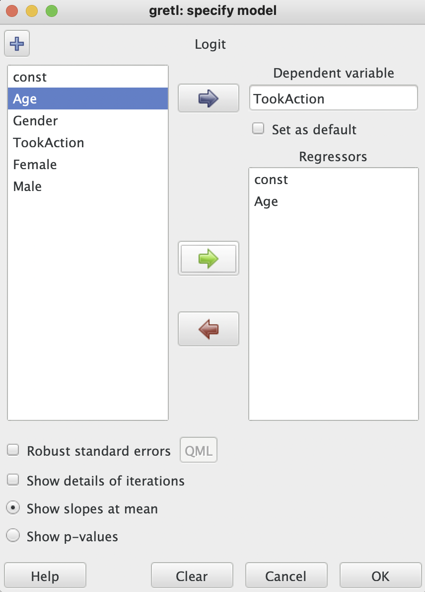
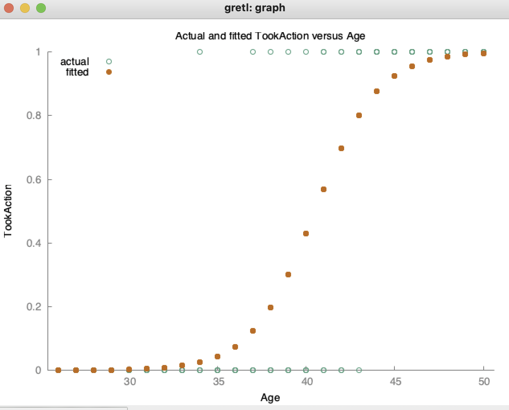
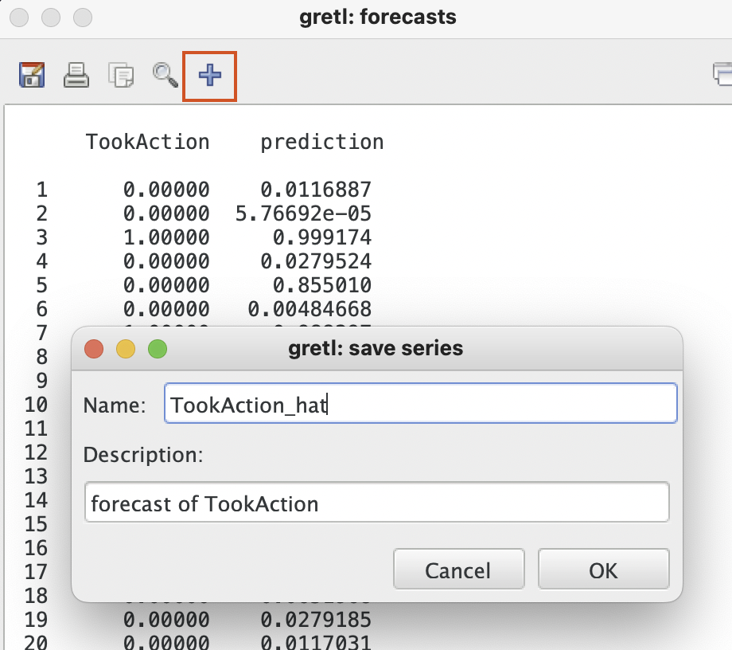
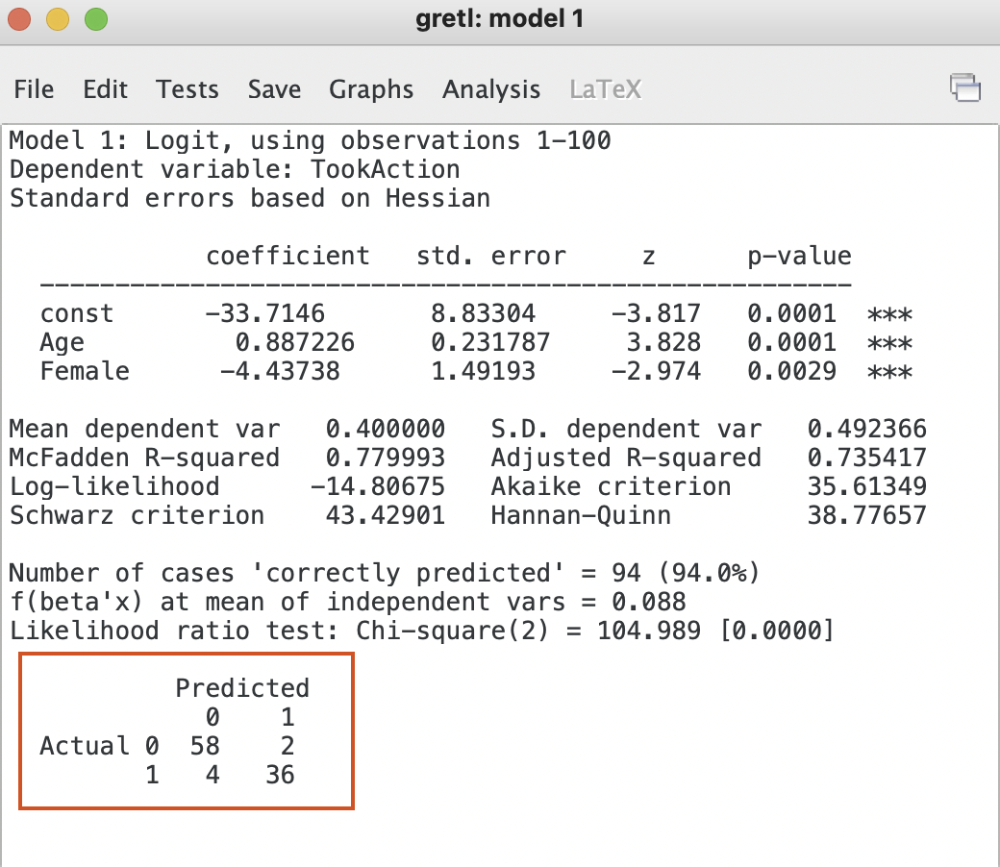

# Logistic Regression with Gretl

Looking at email data by age, gender, and took some action responding to the email. Click `View` > `Graph specified vars` > `X Y Scatter...`.  

 

 

We see the problem does not fit a linear model and that is where Logistic Regression becomes useful. The `sigmoid` line is the best fitting line on these classification datasets.  

 

 

Import email data and dummify the gender variable renaming the attributes accordingly.

 

 

Create a Logistic regression model by clicking `Model` > `Limited dependent variable` > `Logit` > `Binary` and set the **Dependent variable** as `TookAction` and add `Age` to the **Regressors**. Click **OK**.

 

 

 

 

Graph the fitted plot against `Age`.

 

 

Run the model by clicking `Analysis` > `Forecasts` > `OK` and add the variable `TookAction^` to the data. This new variable is `y_hat` or a.k.a the `predictions`.

 

 

Confusion matrix can be see in the lower left corner of the model window. You can calculate accuracy rate and error rate accoringly

1. Accuracy Rate = Correct / Total (94/100=94%)
2. Error Rate = Wrong / Total (6/100=6%)

 

 

### Interpreting coefficients of a logistic regression

Negative coefficient means the effect of the variable is negative (vice versa for positive). Positive coefficients that are greater in value only explain the effect of that coefficient on the variable in the units of the coefficient. Coeffecients cannot be used to quantify the per unit effect of the variable alone on the probability (increase/decrease) or dependent variable and cannot not be used to compare effects of two different independent variables.

Z-score is a standardized coefficient and can be calculated by dividing the `coefficient` by the `std error`. It is not dependent on the units of the independent variable.

 

 
