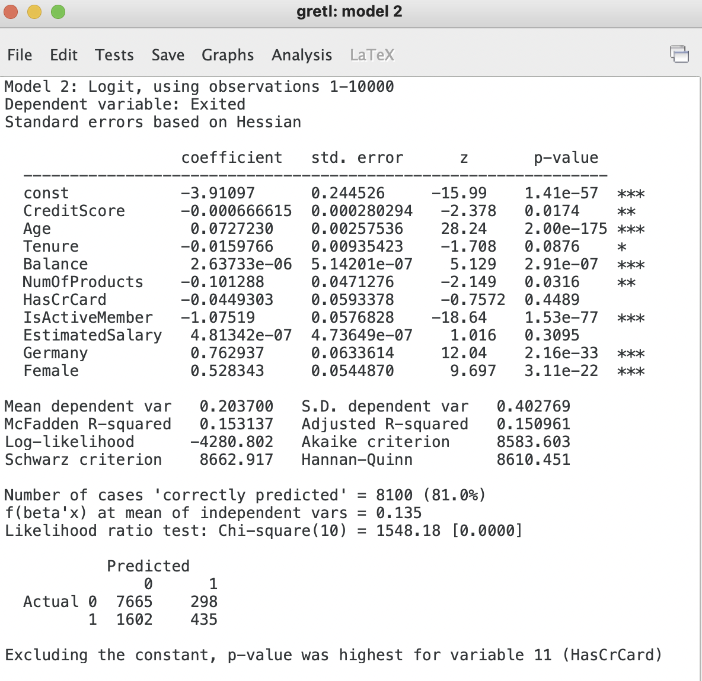

# Geodemographic Segmentation with Gretl

In marketing, geodemographic segmentation is a multivariate statistical classification technique for discovering whether the individuals of a population fall into different groups by making quantitative comparisons of multiple characteristics with the assumption that the differences within any group should be less than the differences between groups. [Wiki](https://en.wikipedia.org/wiki/Geodemographic_segmentation)

## Setting up the model

1. Import `Churn-Modelling.csv` data and dummify the `Geography` and `Gender` variables.
2. Create first model iteration with all relevant values: `Model` > `Limited dependent variable` > `Logit` > `Binary`

 

 

3. Perform backward elimination
4. Remove highest `p-value` variable from Model 1

 

 

5. Continue removing highest `p-value` variable until no variables are left with a higher p-value than our threshold.

 

 

## Transforming independent variables

1. Square root of independent variable (x^1/2)
2. Square of independent variable (x^2)
3. Natural log of independent variable (ln(x))
4. Right click in Gretl window and select `Define new variable`. Enter the name of the variable followed by the method to transform the data.

 

 

## Checking for multicollinearity

Multicollinearity is a statistical concept where several independent variables in a model are correlated. Two variables are considered perfectly collinear if their correlation coefficient is +/- 1.0. Multicollinearity among independent variables will result in less reliable statistical inferences

1. Use the variance inflation factors
2. `Analysis` > `Collinearity`

 

 

3. If you remove `Log_Balance` you can see collinearity disappears and `WealthAccumulation` becomes statistcally significant

 

 
